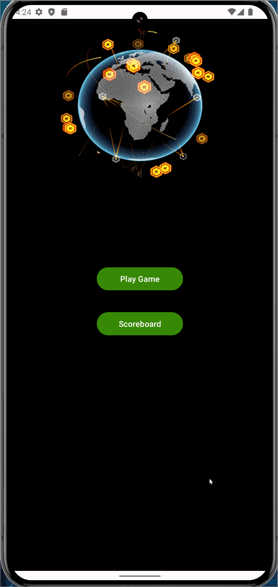

# GeoGuesser App

## Overview
GeoGuesser is an Android application that allows users to explore the world by guessing locations on a map and comparing them to Google Street View. It leverages various technologies including the Google Maps API, Google Street View API, Room database for scorekeeping, and Volley for making HTTP requests.

## Features
- **Map Exploration**: Users can explore the world map and mark locations they think are correct guesses.
- **Street View Integration**: Users can compare their guesses with Google Street View for accuracy.
- **Scoring System**: The app features a scoring system based on the accuracy of the user's guesses.
- **Round Management**: Users can play multiple rounds of the game and track their scores over time.
- **Database Integration**: Scores are stored locally using Room database, allowing users to track their performance.

## Installation
1. Clone or download the repository.
2. Open the project in Android Studio.
3. Build and run the app on an Android device or emulator.

## Usage
1. Launch the app on your Android device.
2. Explore the map to find a location you want to guess.
3. Toggle the map to switch to Google Street View and verify your guess.
4. Mark your guess on the map and confirm your selection.
5. Receive points based on the accuracy of your guess and track your total score.
6. Play multiple rounds to improve your score and compete with friends.

## Dependencies
- Google Maps API
- Google Street View API
- Volley HTTP Library
- Room persistence library

## Walthrough

